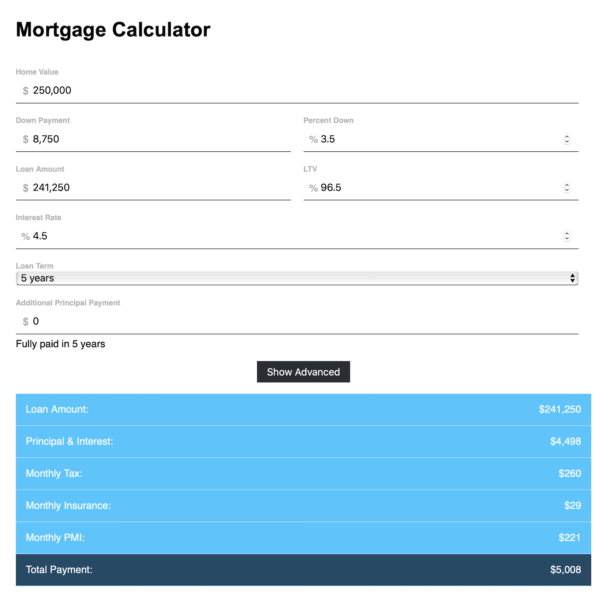
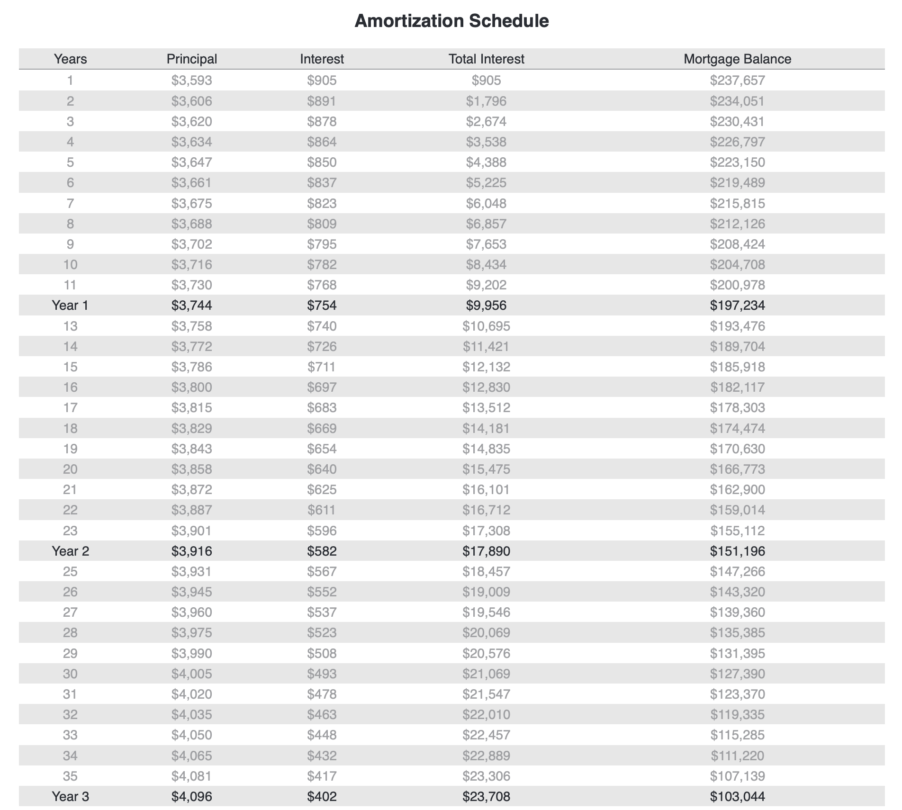

# Mortgage Calculator React
Mortgage Calculator as a component created in React

## Sample App
You can try out the mortgage calculator. Run the following commands to start the sample app.

    // Install dependencies
    Yarn 
    // Start sample app
    Yarn Start

Then open http://localhost:8080 in your browser. If port 8080 is already in-use, the dev server may start on a different port. Look for the following log output: "Project is running at" to determine the correct port.

## Usage in Your App With NPM
Install the calculator as an NPM module.

    npm install mortgage-calculator-react

Then include the mortgage calculator in your app and use it as a React component.

    import MortgageCalculator from "mortgage-calculator-react";
    
    const reactElement = (
        

            <MortgageCalculator/>
        

    );

You can also override default props.

    
    <MortgageCalculator price={125000} downPayment={10000} interestRate={0.065} months={120} additionalPrincipalPayment={100} taxRate={0.01} insuranceRate={0.01} mortgageInsuranceEnabled={false}  />
    
You can also show a full payment schedule.

    <MortgageCalculator showPaymentSchedule />

## CSS Styling
The calculator uses a default style "DefaultStyle.css". You could create a copy of this file and modify it to achieve any aesthetic for the mortgage calculator.

    import customStyle from "./CustomStyle.css";
    <MortgageCalculator styles={customStyle} />

## Embed in Web Page
You can embed the mortgage calculator into any web page. Simply insert the following HTML.

    

    
    
# mortgage-calculator-react
# mortgage-calculator-react
